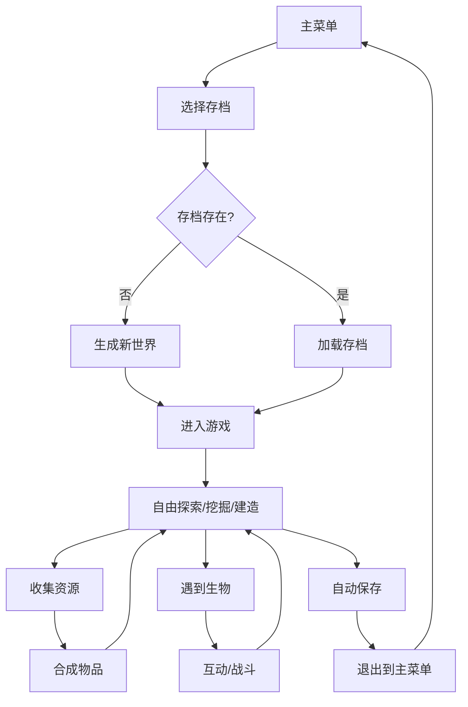

## 1. 产品概述
2D横版沙盒建造游戏，灵感来源于Minecraft，玩家可以在像素风格的世界中挖掘、建造、合成，与AI生物互动，体验自由探索与创造的乐趣。
- 核心目标：提供轻量级、跨平台的2D沙盒游戏体验
- 目标用户：休闲游戏玩家、Minecraft爱好者、学生群体
- 市场价值：填补浏览器端高品质2D沙盒游戏空白，无需安装即开即玩

## 2. 核心功能

### 2.1 用户角色
| 角色 | 注册方式 | 核心权限 |
|------|----------|----------|
| 玩家 | 无需注册，本地存档 | 单人游戏全部功能 |

### 2.2 功能模块
1. **主菜单**：开始游戏、存档管理、游戏设置
2. **游戏主场景**：世界渲染、玩家控制、方块交互
3. **背包与合成**：物品栏管理、合成系统
4. **AI生物系统**：被动/敌对生物、行为AI
5. **存档系统**：多存档管理、本地存储

### 2.3 页面详情
| 页面名称 | 模块名称 | 功能描述 |
|----------|----------|----------|
| 主菜单 | 标题与按钮 | 游戏Logo、开始游戏、继续游戏、存档管理、设置 |
| 主菜单 | 存档列表 | 展示已有存档、新建存档、删除存档、重命名存档 |
| 游戏场景 | 世界渲染 | 区块加载、方块绘制、视差背景 |
| 游戏场景 | 玩家角色 | 移动、跳跃、挖掘、放置、生命值、饥饿值 |
| 游戏场景 | HUD界面 | 生命值条、饥饿值条、快捷物品栏、坐标显示 |
| 游戏场景 | 合成界面 | 2x2合成网格、合成结果输出 |
| 游戏场景 | 生物系统 | 动物走动、怪物追击、碰撞检测 |

## 3. 核心流程
玩家进入游戏后，从主菜单选择新建或加载存档，进入游戏世界后可自由探索、挖掘方块、收集资源、合成物品、建造建筑，同时与AI生物互动。游戏自动保存进度到本地存储。

## 4. 用户界面设计

### 4.1 设计风格
- **主色调**：像素复古风格，以绿色（草地）、棕色（泥土）、蓝色（天空）为主
- **辅助色**：深灰色石质、白色雪、深蓝色水
- **按钮风格**：像素化边框、3D凸起效果、点击下沉动画
- **字体**：像素风格等宽字体，增强复古游戏感
- **布局风格**：游戏画面居中，UI元素分布在屏幕边缘，不遮挡游戏视野
- **图标风格**：像素艺术风格方块图标

### 4.2 页面设计概述
| 页面名称 | 模块名称 | UI元素 |
|----------|----------|--------|
| 主菜单 | 标题区 | 像素艺术Logo、渐变天空背景 |
| 主菜单 | 按钮区 | 垂直排列像素按钮、悬停高亮效果 |
| 主菜单 | 存档列表 | 卡片式存档展示、创建/删除按钮 |
| 游戏场景 | 顶部HUD | 生命值心形图标、饥饿值鸡腿图标 |
| 游戏场景 | 底部物品栏 | 9格快捷栏、当前选中高亮、物品数量 |
| 游戏场景 | 合成界面 | 半透明深色面板、合成网格、箭头指示 |
| 游戏场景 | 触控按钮 | 移动端虚拟摇杆、动作按钮 |

### 4.3 响应式
- 桌面端：键盘鼠标操作，固定像素比例渲染
- 移动端：虚拟摇杆+触控按钮，自适应屏幕尺寸，保持画面比例
- 触控优化：增大可点击区域，支持多指触控

### 4.4 游戏场景指导
- **世界生成**：程序化生成地形，包含草地、泥土、石头、矿石、树木
- **区块系统**：16x16方块为一个区块，按需加载卸载
- **相机系统**：玩家保持屏幕中心，地图有边界限制
- **物理系统**：重力、碰撞检测、方块支撑
- **光照系统**：基础明暗效果，区分昼夜（可选简化版）
