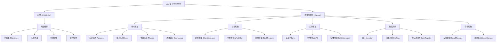

## 1. 架构设计
纯前端单页游戏应用，使用Canvas 2D进行渲染，所有数据本地存储。



## 2. 技术描述
- **前端技术栈**：原生 HTML5 + CSS3 + JavaScript (ES6+)
- **渲染**：HTML5 Canvas 2D API
- **存储**：LocalStorage（存档数据）
- **无外部依赖**：纯原生实现，零依赖，加载快速
- **构建工具**：无需构建工具，直接运行

选择原生实现的原因：
1. 2D像素游戏性能需求在Canvas下原生实现足够
2. 零依赖加载速度快，即开即玩
3. 便于理解和维护
4. 跨平台兼容性好

## 3. 文件结构
```
/workspace/
├── index.html              # 入口文件
├── css/
│   └── style.css           # 样式文件（UI界面）
├── js/
│   ├── main.js             # 游戏入口
│   ├── core/
│   │   ├── Game.js         # 游戏主类
│   │   ├── Renderer.js     # 渲染器
│   │   ├── Input.js        # 输入管理
│   │   └── Physics.js      # 物理系统
│   ├── world/
│   │   ├── World.js        # 世界类
│   │   ├── Chunk.js        # 区块类
│   │   ├── WorldGen.js     # 世界生成
│   │   └── Blocks.js       # 方块定义
│   ├── entity/
│   │   ├── Entity.js       # 实体基类
│   │   ├── Player.js       # 玩家类
│   │   ├── Mob.js          # 生物基类
│   │   ├── mobs/           # 具体生物
│   │   │   ├── Sheep.js    # 羊
│   │   │   ├── Pig.js      # 猪
│   │   │   └── Zombie.js   # 僵尸
│   │   └── EntityManager.js
│   ├── item/
│   │   ├── Item.js         # 物品基类
│   │   ├── Items.js        # 物品定义
│   │   ├── Inventory.js    # 背包
│   │   └── Crafting.js     # 合成系统
│   ├── save/
│   │   └── SaveManager.js  # 存档管理
│   └── ui/
│       ├── MainMenu.js     # 主菜单
│       ├── HUD.js          # HUD
│       ├── CraftingUI.js   # 合成界面
│       └── TouchControls.js # 触控控件
└── assets/                 # 资源（可选，用Canvas绘制替代）
```

## 4. 核心数据结构

### 4.1 方块数据
```javascript
// 方块类型枚举
const BlockType = {
  AIR: 0,
  GRASS: 1,
  DIRT: 2,
  STONE: 3,
  WOOD: 4,
  LEAVES: 5,
  SAND: 6,
  WATER: 7,
  COAL_ORE: 8,
  IRON_ORE: 9,
  PLANKS: 10,
  COBBLESTONE: 11,
  // ... 更多方块
};

// 方块属性
const BlockProperties = {
  [BlockType.GRASS]: { name: 'grass', solid: true, hardness: 0.6, color: '#4CAF50' },
  [BlockType.DIRT]: { name: 'dirt', solid: true, hardness: 0.5, color: '#8B4513' },
  // ...
};
```

### 4.2 区块数据
```javascript
// 区块大小
const CHUNK_WIDTH = 16;
const CHUNK_HEIGHT = 128;

// 世界边界
const WORLD_WIDTH_CHUNKS = 32; // 共32个区块 = 512方块宽
const WORLD_HEIGHT = CHUNK_HEIGHT;
```

### 4.3 玩家数据
```javascript
{
  x: number,           // 世界坐标（像素）
  y: number,
  vx: number,          // 速度
  vy: number,
  width: number,       // 碰撞箱宽高
  height: number,
  health: number,      // 生命值 0-20
  hunger: number,      // 饥饿值 0-20
  onGround: boolean,
  facing: number,      // 朝向 1右 -1左
  inventory: Inventory,
  selectedSlot: number,
}
```

### 4.4 存档数据结构
```javascript
{
  id: string,
  name: string,
  createdAt: timestamp,
  lastPlayed: timestamp,
  seed: number,
  player: { ...玩家数据 },
  chunks: {
    [chunkX]: {
      blocks: Uint8Array, // 方块数据
      modified: boolean,  // 是否被修改过
    }
  },
  entities: [ ...实体数据 ]
}
```

## 5. 核心算法

### 5.1 世界生成
- 使用柏林噪声(Perlin Noise)或简化的正弦叠加生成地形高度
- 叠加多层噪声生成矿脉、洞穴
- 树木随机分布生成

### 5.2 碰撞检测
- AABB（轴对齐包围盒）碰撞检测
- 分轴检测：先水平后垂直
- 与方块网格的碰撞：基于玩家位置计算相邻方块

### 5.3 区块加载
- 以玩家位置为中心，加载周围N个区块
- 超出范围的区块卸载（保存修改后）
- 视口裁剪：只渲染可见区域的方块

### 5.4 生物AI
- 被动生物：随机游走、吃草、逃离玩家
- 敌对生物：追击玩家、攻击
- 状态机实现AI行为

## 6. 输入控制

### 桌面端
- **A/D 或 ←/→**：左右移动
- **W/空格/↑**：跳跃
- **鼠标左键**：挖掘方块
- **鼠标右键**：放置方块
- **E**：打开/关闭背包/合成
- **1-9**：切换快捷栏
- **Esc**：暂停

### 移动端
- **虚拟摇杆**：移动方向
- **跳跃按钮**：跳跃
- **挖掘按钮**：长按挖掘
- **放置按钮**：放置方块
- **合成按钮**：打开合成界面
